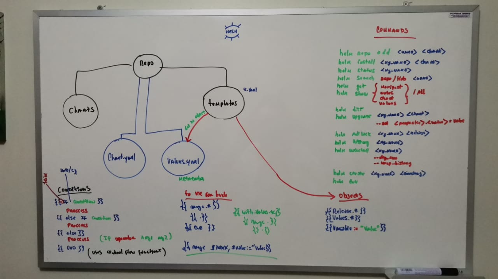

# helm3

## Commands Use Helm
```bash
#install helm
sudo snap install helm --classic
helm version

#commands for repositories
helm repo add stable https://charts.helm.sh/stable

#install app apache
helm repo add bitnami https://charts.bitnami.com/bitnami
helm install my-apache bitnami/apache --version 7.3.17
helm status my-apache

#install app redis
helm install my-redis bitnami/redis --version 15.0.3
helm status my-redis

#commands search
helm search repo stable | grep -v DEPRECATED #find all repos without  deprecated
helm search repo stable | wc -l #count
helm search hub httpd -o yaml #find in artifact hub
helm search repo apache --version 1.05 #find with version

#commands GET
helm get manifest my-apache #view manifest YAML how to created
helm get notes my-apache #view notes info, this info view when install
helm get values my-apache #params, values, properties
kubectl get all -o name
helm get all my-apache
helm show readme bitnami/apache | grep port
helm show values bitnami/apache | grep port

#commands SHOW
helm show readme bitnami/apache
helm show chart bitnami/apache #info chart
helm show values bitnami/apache #info values defined chart
helm list #change REVISION / helm ls
helm show all bitnami/apache

#commands UPGRADE
helm upgrade my-apache bitnami/apache
helm upgrade --set service.port=8080 my-apache bitnami/apache
helm get values my-apache #check change port
helm get manifest my-apache #check change port
curl 10.101.47.196:8080
helm upgrade --set service.port=8080 --set service.type=NodePort my-apache bitnami/apache
curl http://192.168.10.88:31820 #IP minikube
helm show values bitnami/apache > upgrade/apache.yaml
helm upgrade -f upgrade/apache.yaml my-apache bitnami/apache

#commands ROLLBACK
helm rollback my-apache 3
helm history my-apache #new relase from release 3
helm history my-apache

#commands DELETE
helm uninstall --dry-run my-apache #show TODO
helm uninstall --keep-history my-apache #save history

#commands CREATE
helm create chart1 .

#other commands
helm repo list
helm env #show variables environment of helm
helm history my-apache

#commands Remove
helm repo remove elastic

#commands Kubernetes
kubectl get svc --namespace default -w my-apache #w -> watch
kubectl logs my-apache-76c49dd54-dw927
minikube ip
curl http://$(minikube ip):31078
```

## Commands Deploy
```bash
cd charts/chart1 && helm install r1 .
kubectl get pods
helm install --dry-run d1 .#check TODO
helm install --debug --dry-run d1 .

#view how to install chart before to do install
helm install --dry-run mysql1 .
#in case of install with errors
helm install mysql1 .
#after install run, with changes
helm upgrade mysql1 .
```

## Commands changes

```bash
#view chart before apply changes
helm get manifest value1
#view change to apply
helm upgrade --dry-run value1 . -f values1.yaml
#apply changes
helm upgrade value1 . -f values1.yaml
#change values with --set
helm upgrade value1 . --set limits.memory="200Mi"
```

## Board
